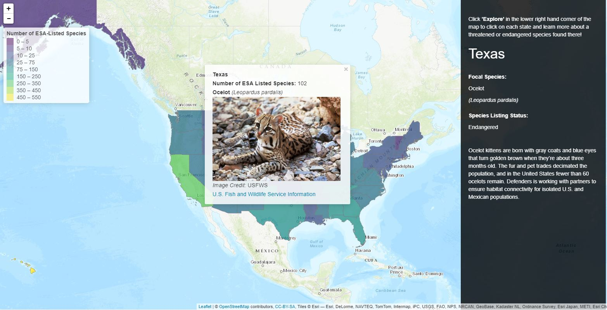

# USA Threatened and Endangered Species Map by State
###### Choropleth map highlighting a single threatened or endangered species in all 50 states plus the District of Columbia. This maps provides brief information on the species and access to each species' page in the U.S. Fish and Wildlife Service's species database, ECOS.

# national_forests_synthesis
# national_forests_synthesis
